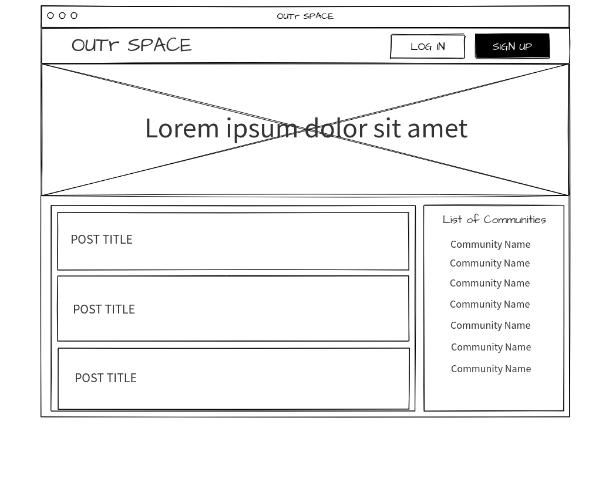

# OUTr SPACE

- [Overview](#Overview)
  - [Core Features](#Core-Features)
  - [Goals](#Goals)
  - [Team](#Team)
  - [Permissions](#Permissions)
- [MVP](#MVP)
  - [Client (Front End)](#Client-Front-End)
    - [Wireframes](#Wireframes)
    - [Component Hierarchy](#Component-Hierarchy)
    - [Component Breakdown](#Component-Breakdown)
    - [Component Estimates](#Component-Estimates)
  - [Server (Back End)](#Server-Back-End)
    - [ERD Model](#ERD-Model)
    - [Data Heirarchy](#Data-Heirarchy)
    - [Data Heirarchy](#Data-Heirarchy-1)
  - [Dependencies](#Dependencies)
- [Post-MVP](#Post-MVP)
- [Code Showcase](#Code-Showcase)
- [Code Issues & Resolutions](#Code-Issues--Resolutions)

<br>

## Overview

_**OUTr SPACE** is a community based social media platform inspired by [Reddit](https://www.reddit.com/), where users can create their own galaxies (communities) and start discussions with other members._

### Core Features

_All of the content is available for public viewing, but in order to perform actions such as creating communities or posts, the user must sign up for an account and be logged in. While logged in, the user will be able to perform the following actions:_

- _Create a community._
- _Create, edit, and delete posts._
- _Create, edit, and delete comments._
- _Upvote or downvote posts and comments._

### Goals

- _Improve upon the comment tree to give users choice on which threads they want to view._
- _Have a clean and minimalist design for users to easily navigate._
- _Fully responsive on all screen sizes._

### Team

Created, designed, and developed by [Jose Ferreira](https://github.com/joseferreira5).

<br>

## MVP

_The **OUTr SPACE** MVP should allow for a user to sign up and log in, granting them the ability to create a new community, then create, edit, or delete their own posts within any community._

### Client (Front End)

#### Wireframes

- Desktop Landing



- Resource Index


- Mobile Resource Index


#### Component Hierarchy

```structure

src
|__ assets/
      |__ images
      |__ mockups
|__ components/
      |__ Comment.js
      |__ CreateComment.js
      |__ CreatePost.js
      |__ EditComment.js
      |__ EditPost.js
      |__ Footer.js
      |__ Galaxy.js
      |__ Header.js
      |__ LogIn.js
      |__ Post.js
      |__ Posts.js
      |__ SignUp.js
      |__ shared
          |__ Button.js
          |__ GlobalStyle.js
          |__ theme.js
          |__ Title.js
|__ services/
      |__ api.js
      |__ auth.js
|__ App.js
|__ Index.js

```

#### Component Breakdown

|  Component   |    Type    | state | props | Description                                                      |
| :----------: | :--------: | :---: | :---: | :--------------------------------------------------------------- |
|    Header    | functional |   n   |   n   | _The header will contain the navigation and logo._               |
|              | functional |   n   |   n   | _The navigation will provide a link to each of the pages._       |
|   Gallery    |   class    |   y   |   n   | _The gallery will render the posts using cards in flexbox._      |
| Gallery Card | functional |   n   |   y   | _The cards will render the post info via props._                 |
|    Footer    | functional |   n   |   n   | _The footer will show info about me and a link to my portfolio._ |

#### Component Estimates

| Task                | Priority | Estimated Time | Time Invested | Actual Time |
| ------------------- | :------: | :------------: | :-----------: | :---------: |
| Add Contact Form    |    L     |     3 hrs      |     2 hrs     |    3 hrs    |
| Create CRUD Actions |    H     |     3 hrs      |     1 hrs     |     TBD     |
| TOTAL               |          |     6 hrs      |     3 hrs     |     TBD     |

<br>

### Server (Back End)

#### ERD Model


#### Data Heirarchy

```structure

database_db
|__ users/
|__ galaxies/
|__ posts/
|__ comments/
|__ votes/
|__ subscriptions/

```

#### Data Heirarchy

- GET /api/users
- GET /api/users/:id
- POST /api/users
- PUT /api/users/:id
- GET /api/galaxies/
- GET /api/galaxies/:id
- POST /api/galaxies/
- GET /api/galaxies/:galaxy_id/posts/
- GET /api/galaxies/:galaxy_id/posts/:id
- POST /api/galaxies/:galaxy_id/posts/
- PUT /api/galaxies/:galaxy_id/posts/:id
- DELETE /api/galaxies/:galaxy_id/posts/:id

<br>

### Dependencies

|      Library      | Description                        |
| :---------------: | :--------------------------------- |
|       React       | _JavaScript framework for client._ |
|   React Router    | _Routing React components._        |
| Styled Components | _CSS in JS._                       |
|   Styled Reset    | _CSS Reset for styled components._ |
|       Rails       | _Server side API._                 |

<br>

---

> This section is not necessary for your pitch!

## Post-MVP

> Use this section to document ideas you've had that would be fun (or necessary) for your Post-MVP. This will be helpful when you return to your project after graduation!

---

## Code Showcase

> Use this section to include a brief code snippet of functionality that you are proud of and a brief description.

## Code Issues & Resolutions

> Use this section to list of all major issues encountered and their resolution, if you'd like.
